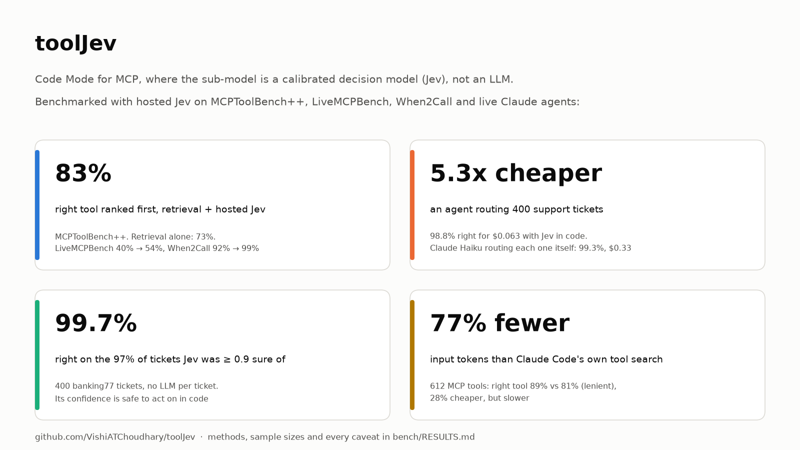
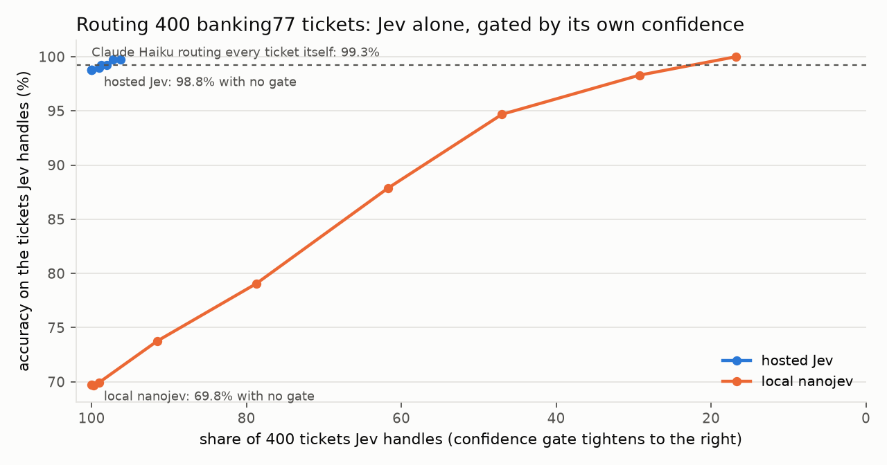
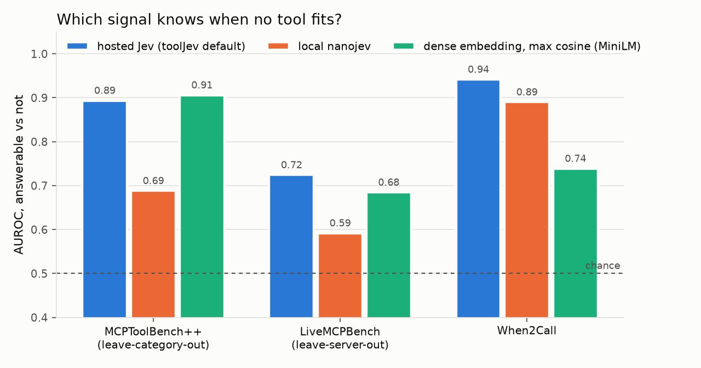
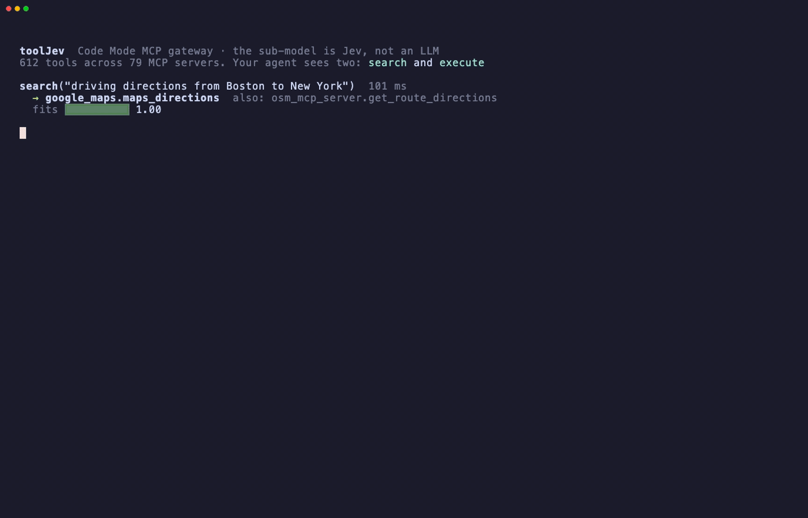
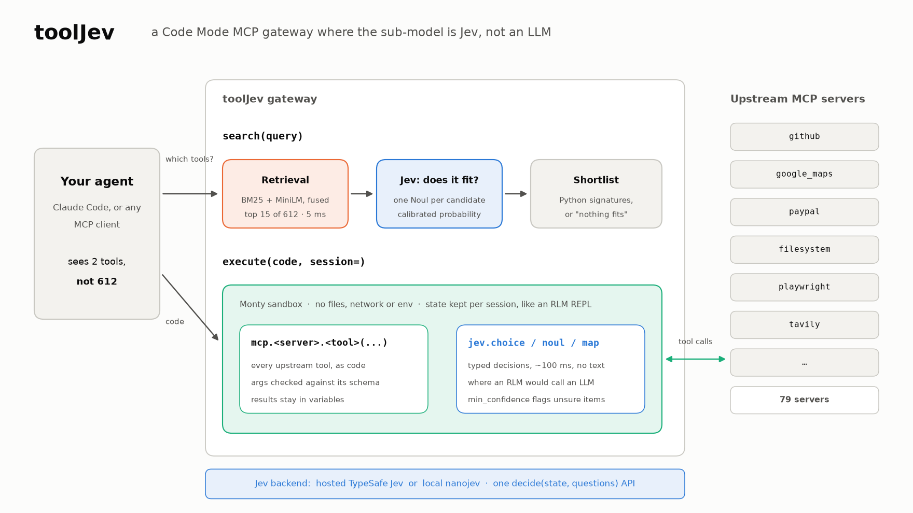

<div align="center">

# toolJev

### Code Mode for MCP, where the sub-model is a decision model, not an LLM.

**Your agent doesn't need an LLM for every decision.**<br>
612 tools: **77% fewer tokens**. 400 tickets: **5.3x cheaper, 98.8% accurate**.

[](https://github.com/VishiATChoudhary/toolJev/actions/workflows/ci.yml)
[](https://www.python.org)
[](LICENSE)

</div>

## Results

I benchmarked toolJev with hosted [Jev](https://typesafe.ai) on MCPToolBench++,
LiveMCPBench, When2Call and live Claude Haiku agents. Several results went
against my first design, and the design changed to match.

<p align="center"></p>

| Question | Result (hosted Jev) | Takeaway |
|---|---|---|
| Does it pick the right tool? | Right tool ranked first: **83%** on MCPToolBench++, **54%** on LiveMCPBench, **99%** on When2Call. Retrieval alone: 73%, 40%, 92%. Jev alone, with no retrieval: 18% | Retrieval shortlists, Jev picks |
| Does it know when no tool fits? | AUROC **0.94** on When2Call near-misses (embeddings 0.74), **0.72** on LiveMCPBench (0.68), 0.89 on out-of-domain MCPToolBench++ (0.91) | The one signal that handles both kinds of miss |
| Can Jev make per-item decisions? | **98.8%** on 400 support tickets, alone. The 97% it was ≥ 0.9 sure of: **99.7%**. Claude Haiku doing every ticket: 99.3% | Confident answers are safe to act on in code |
| Agent routing those 400 tickets | **98.8% for $0.063**, against 99.3% for $0.332 with Haiku routing each ticket itself | **5.3x cheaper** at about the same accuracy |
| Agent with 612 tools | Right tool called in **89%** of tasks vs 81% for Claude Code's own tool search, with **77% fewer** input tokens and **28% lower** cost, but slower (34 s vs 18 s) | Pays off at scale |
| Agent with 87 tools | Direct tool calling was more accurate (0.94 vs 0.89) and cheaper (local backend) | Don't bother below ~100 tools |

<p align="center">


</p>

Sample sizes, methods and every caveat are in **[bench/RESULTS.md](bench/RESULTS.md)**.
The short version of the caveats:
- hosted routing numbers use up to 200 answerable + 200 unanswerable queries per benchmark
- the agent runs use 1 to 2 reps and 36 tasks per setup; at that size 89% vs 81% is three tasks
- upstream servers are mocks built from each benchmark's tool schemas
- the 87-tool agent run and the GIF use [nanojev](https://github.com/VishiATChoudhary/nanojev), a local stand-in for Jev that is much less accurate

## What it is



*A real run with local models and no API key: `uv run python examples/showcase.py`*

Give an agent 600 MCP tools and it drowns in tool schemas. Give it one tool
call per turn, and a 400-item job takes 400 calls. toolJev sits in front of
every MCP server you have and gives the agent **two tools** instead:

- **`search(query)`** finds the few tools a request needs. Retrieval shortlists
  them, and [Jev](https://typesafe.ai) says whether any of them actually fits.
  Jev is a decision model: it returns calibrated probabilities over options you
  give it, never text.
- **`execute(code)`** runs Python the agent writes. The code calls tools as
  `mcp.<server>.<tool>()`, and makes per-item judgements with
  `jev.choice / noul / map`: typed answers in about 100 ms, no LLM turn. This is
  [Code Mode](https://blog.cloudflare.com/code-mode-mcp/) crossed with a
  [Recursive Language Model](https://arxiv.org/abs/2512.24601), with Jev in the
  place of the sub-LLM.

<p align="center"></p>

The LLM writes the plan once, Jev makes the per-item calls, and only the items
Jev is unsure about come back to the LLM.

## How to use it

### 1. Install

```bash
git clone https://github.com/VishiATChoudhary/toolJev && cd toolJev
uv venv && uv pip install -e ".[local,retrieval]"
```

The two extras:
- `local` installs [nanojev](https://github.com/VishiATChoudhary/nanojev), which
  runs Jev-style decisions on your machine with no key. The model downloads
  once.
- `retrieval` adds embedding search next to BM25.

For real use, set `TYPESAFE_API_KEY` and use hosted Jev (`backend = "hosted"`,
the default when the config has no `[decider]` table). It is much more accurate than the local
stand-in: see Results.

### 2. Try it

```bash
uv run python examples/showcase.py   # the GIF above: 612 tools, 400 tickets, all local
uv run python examples/demo.py       # the real gateway over MCP stdio, 3 toy upstream servers
```

### 3. Point it at your MCP servers

Write a TOML file with one table per upstream server. Anything you'd give an MCP
client goes in it: `command`/`args`/`env` for local servers, `url`/`headers`
for remote ones.

```toml
# tooljev.toml
[decider]
backend = "hosted"      # reads TYPESAFE_API_KEY; or "nanojev" (+ kind = "encoder") to run with no key

[servers.github]
description = "GitHub repos, issues and pull requests"
command = "npx"
args = ["-y", "@modelcontextprotocol/server-github"]
env = { GITHUB_PERSONAL_ACCESS_TOKEN = "ghp_..." }

[servers.tickets]
description = "Customer support tickets: list, assign, close"
url = "https://support.example.com/mcp"
headers = { Authorization = "Bearer ..." }
allow = ["list_tickets", "assign_ticket"]   # optional: expose only these tools
```

A one-line `description` per server helps search a lot. Every option, with its
default, is in [`examples/config.toml`](examples/config.toml).

### 4. Connect your agent

toolJev is an ordinary MCP server, so any MCP client works. For Claude Code:

```bash
claude mcp add tooljev -- uv --directory /path/to/toolJev run tooljev --config /path/to/tooljev.toml
```

For remote clients, serve streamable HTTP with
`uv run tooljev --config tooljev.toml --transport http --port 8765`.

### 5. What your agent does with it

The agent never sees your upstream tools directly. It works in two moves.

**Find tools:** `search("refund order 1234 on paypal")` returns up to 5 tools,
each with a Python signature and a `fit` score. If nothing in the catalog fits,
the result carries a warning so the agent answers on its own.

**Run code:** `execute(code)` runs Python with the found tools and `jev` in
scope:

```python
tickets = await mcp.support.list_tickets()
answers = await jev.map([t["body"] for t in tickets],
                        {"queue": jev.Choice("Which queue handles this?", QUEUES)},
                        min_confidence=0.8)
unsure = []
for t, a in zip(tickets, answers):
    if a["confident"]:                    # Jev is sure: act in code
        await mcp.support.route_ticket(ticket_id=t["id"], queue=a["queue"]["choice"])
    else:                                 # Jev is not: hand back to the agent
        unsure.append(t["id"])
FINAL({"unsure": unsure})                 # only this reaches the agent's context
```

What's in scope inside `execute`:

| call | returns |
|---|---|
| `await mcp.<server>.<tool>(**kwargs)` | the tool's result; arguments are checked against its schema first |
| `await jev.choice(state, instructions, options)` | `{"choice", "probabilities", "confidence"}` |
| `await jev.noul(state, statement)` | probability the statement is true |
| `await jev.score(state, instructions, levels)` | `{"score", "probabilities", "confidence"}` |
| `await jev.map(states, questions, min_confidence=)` | one answer dict per state, plus `"confident"` when a threshold is given |
| `FINAL(value)` / `print(...)` | what goes back to the agent (the last expression also works) |

Pass `execute(code, session="work")` to keep variables between calls, like a
REPL: fetch once, inspect, then act. You don't need to teach your agent any of
this; the tool descriptions do.

### 6. When to use it, and when not

**Use it when:**
- You connect **hundreds of tools**. At 612 tools it cut input tokens by 77%
  and cost by 28% against Claude Code's own tool search (right tool 89% vs
  81% lenient, 72% vs 75% strict).
- Your agent does **the same judgement over many items**: triage, routing,
  filtering, labelling. With hosted Jev, 400 tickets were routed 5.3x cheaper
  than by the LLM, at 98.8% vs 99.3%. Gate on Jev's confidence and let the LLM
  take the unsure ones.

**Skip it when:**
- You have **fewer than about 100 tools**. Direct tool calling was more
  accurate and cheaper at 87 tools.
- You need **every item right** and cost doesn't matter. The LLM alone was
  still half a point more accurate on triage.
- **Latency** matters more than tokens. Each search is a hosted round trip
  (about 285 ms), and Code Mode adds a turn.

## How it works

### Backends

| `[decider] backend` | What | Needs |
|---|---|---|
| `hosted` (default, recommended) | TypeSafe Jev via `typesafe-sdk`. Search reranks with it | `TYPESAFE_API_KEY` |
| `nanojev` | [nanojev](https://github.com/VishiATChoudhary/nanojev), a local stand-in, `kind = "encoder"` or `"decoder"`. Search keeps retrieval order | nothing (downloads a model once) |

Both implement one method, `decide(state, questions) -> answers`, in TypeSafe's
wire format, so everything above the backend is shared. Use the encoder for
nanojev: the decoder could not tell in-catalog requests from out-of-catalog
ones.

### How `search` decides

1. **Recall:** BM25 and bge-base embeddings over every tool's description, fused
   by reciprocal rank. The top 15 go on. This takes a few milliseconds, and the
   embeddings are cached per tool.
2. **Rank and fit, in one Jev call:** a Choice over the 15 candidates reorders
   them, and a Noul per candidate ("this request asks to <what the tool does>")
   becomes that tool's `fit`. With hosted Jev the rerank lifts top-1 over
   retrieval alone on every benchmark (MCPToolBench++ 0.73 to 0.83). The local
   nanojev encoder reranks worse than retrieval, so with it the Choice is skipped
   and retrieval order stands (`rerank = true/false` overrides either way).
3. **Nothing fits:** `in_catalog` is the best fit. Below `abstain_below`
   (default 0.5), the result carries a warning but still lists the tools.
   `abstain = "hard"` returns none instead. Hiding tools cost agents more in
   wrong detours than a warned shortlist did.
4. The top `max_tools` (default 5) come back, each with a Python signature.

`mode = "hierarchical"` (Jev picks a server, then a tool, with knockout rounds
past the 255-option limit) is the original design, kept because the benchmarks
rejected it.

Search latency on MCPToolBench++: about 285 ms p50 with hosted Jev, 74 ms with
the local encoder.

### Sandbox

Each `execute` runs in a [Monty](https://github.com/pydantic/monty) worker with
no filesystem, network or environment access. It gets a fresh worker unless it
names a `session`; up to 8 sessions are kept, and the least recently used one
goes first.

Limits, all set under `[sandbox]`, are sized for bulk jobs of hundreds of items:
- 120 s wall clock and 20 s of sandbox CPU
- 256 MB of memory
- 2,000 host calls; a whole `jev.map` counts as one call, up to 5,000 items
- 16 concurrent calls
- stdout truncated at 4k characters

Behaviour worth knowing:
- A session that hits a time or memory limit is discarded, as Monty advises.
- When an upstream tool fails, sandbox code sees a catchable `RuntimeError`.
- Each search and execute, and every host call inside it, is logged to
  `~/.tooljev/traces/YYYY-MM-DD.jsonl`.

**The sandbox is not authorization.** Anything a listed upstream tool can do,
sandbox code can do. Use per-server `allow = [...]` to expose less.

## Not yet

- **Free-text arguments.** Jev cannot write them; the agent writes them in code.
- **An `llm_query` fallback** inside the sandbox.
- **Hosted Jev on the full routing sets and the 87-tool agent task.** It ran
  on a 200 + 200 sample per benchmark.
- **One combined abstention score.** Fusing embedding similarity with Jev's fit
  is not done yet; a simple fitted combination did not beat embeddings alone.

## Reproduce

```bash
uv pip install -e ".[local,retrieval,dev,bench]"
uv run pytest -m "not slow"                                      # offline: fake decider, in-process servers
uv run pytest -m slow                                            # real nanojev
uv run python -m bench.run && uv run python -m bench.report      # routing + abstention benchmarks
TYPESAFE_API_KEY=... bash bench/hosted.sh                        # every hosted-Jev run, resumable
uv run python -m bench.agent.run_agent --task triage --n 40      # agent in the loop (uses `claude -p`)
```

Benchmark data is not committed. Fetch it into `bench/data/` as listed in
[bench/RESULTS.md](bench/RESULTS.md#data).

## Prior art and credit

- **Code Mode:** [Cloudflare](https://blog.cloudflare.com/code-mode-mcp/),
  [Anthropic](https://www.anthropic.com/engineering/code-execution-with-mcp)
  and [FastMCP](https://gofastmcp.com/servers/transforms/code-mode).
- **Recursive Language Models:** [Zhang, Kraska and Khattab](https://arxiv.org/abs/2512.24601).
- **Jev:** [TypeSafe](https://typesafe.ai).
  [nanojev](https://github.com/VishiATChoudhary/nanojev) is a small local
  stand-in with the same interface.
- **Sandbox:** [Monty](https://github.com/pydantic/monty), by Pydantic.
- **Tool retrieval:** [RAG-MCP](https://arxiv.org/abs/2505.03275),
  [MCP-Zero](https://arxiv.org/abs/2506.01056) and "Selection Is Retrieval,
  Abstention Is Not" ([arXiv 2609.18672](https://arxiv.org/abs/2609.18672)).
  This repo reached the same conclusion the hard way.

The full prior-art survey is in [RESEARCH.md](RESEARCH.md).
